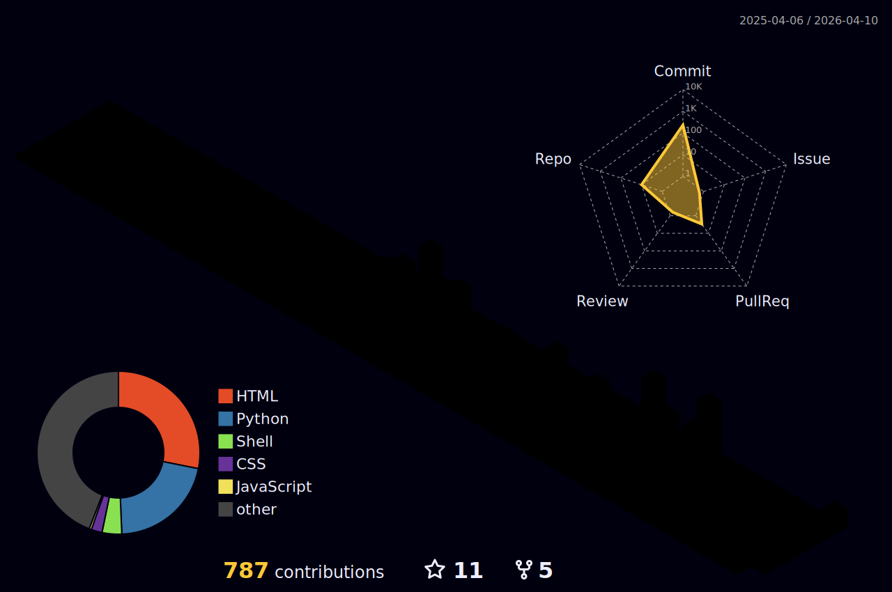

<!-- # 
 Welcome to Atharva's Digital Universe 
 -->

  

<!-- # Hi 👋, I'm Atharva Tilewale
### Biotechnologist | Bioinformatician | Computational Biologist -->

  

## About Me

                                                                      
 
 -{{--{{--{{--{-{---------------------------------{{-{{{-{--{{{{{{{-{ 
 {{{{{{{{-{{{{-{--{----{-------{--{--{{-{{{-{{{{-{{---{--{-{--{{-{{{{ 
 {{-------{-{--------------------------------------{--{--{--{-{-{{-{{ 
 {{{{{{{-{{-{-{--{{------------>>"    ""I>->----{--{-{-{-{-{{{{--{{{{ 
 {{{{-{-{{---------------->-"               I>---{--{---{{-{{---{{-{{ 
 {{{{--{--{{-{----{------I   -@@@@@@@M@M@Mdj  ">------{--{-{-{{{{{{{{ 
 {{{-{---{-----{----->->   a@MJcjcjj|jj||{|cJd> I>----{--{-{-{{{{{{{{ 
 {-{{-{{--{-{----{--->   @@dJcccjjjccjj||||{-|jj{I>----{-{-{{{{{{{{{- 
 {{{{-{{-{{---------"  a@aJcjjjj|j||jj||||{|{{{{|{{>->---{---{{{{{{{{ 
 {-{{-{{--{--{-----" J@aJcjjjjjjjccjjjjjjcj|{{->|>{{{--{-{-{{{{{{{{{{ 
 {{{{{--{--{----->> c@Jcccccccccjccccjjjj|j|{->>>-->{{---{-{{-{{{{{{{ 
 -{{{{-{-{{----->-I @dccccccJccJJccjcjJcOccj|{{{---->------{{{{{{{{{{ 
 {{{--{{----------  @OccJcJJJJccccccjjjjc|j|j{{{->>--I{--{-{{{{-{{{{{ 
 {{-{{-{-{-{------  @JJcJJcj|jj||jjjjjjj{{--{--I>-III"{----{--{{{-{{{ 
 -{--{{-{{{-{----- -@ccc-       "I>{{{{{-"         "I |-----{{{{{{{{{ 
 {{{{{{{--{----->- -@j|{J@@@@@@@MaJjjcJOa@@@@@@@@@j " |----{-{{{{{{{{ 
 {--{---------->    M{Jd|-I""-daM@@adMM@OJcj>""I   "  I">-----{-{{{-{ 
 {{{-{{{--{--->I @@@ajjcd@|O@@aM@adOJ| -@@@@@@@I M"  {@  -----{-{-{-{ 
 --{----{----->" @aj-jcdM@@>@@@-@@@c{{ a@@{|@@- jjJ-  |@ --{-{--{{{-{ 
 {{-{{-{-------" @d@{ccj|{Jadd@@OJj{cj  |@@@OJ|   |{  @I -----{{-{{{{ 
 ------------>-I @@@-{||{||cJOj>{jcjjc     JdJ|>>|{I  @O >-----{--{-{ 
 {{---------->-> a@dj{jc|||{---jac{{{{" >    {cOj{>"  ca >----{--{--- 
 -{--{-{-------> a@@@{dJc|||||Jc  ">|d    @O-{-{|--> cM| --------{-{- 
 --{-{----------  j @Jjjcj||jcJOM@aOdM >O JMdc-I->I" aa I--{--{{---{{ 
 {{----{------>->   @@ccjcjcc|>I>Oad>I> >->{cj|-I"""{" I---------{--- 
 ---{-------------> -@aj{|cc{I-c@@@@@@@@@{   j{>   jcI>-------{--{--- 
 -{{--{--------->->  @@MMccj@@@@J|>"    {Jaa|>{  "|j{">--------{-{-{{ 
 -{-{--{----------->  @@MOjcM@@dda@@@@@@j@@@@J- >JdM >->-->---------- 
 {--{-{-----{------>I j@@cccj----I         c@a|Ij|@I ------{-----{--- 
 -{{---{-------->--->  c@@jjcJJOM@@@@@Jcj--"jc  O@- I---------------- 
 -{{{-{--------->--->>  @@@Mj{{{|jJ@@a@@dJjjj{IO@I I>>-------------{- 
 ------{>--------->>>   aM@@@Mdj>>>-|I"   "-{@@J  I->---------------- 
 ------------------"  OJ@{|@@@@aMMaaaMddJ|jc@@  a  >-->-------------- 
 ------------>-->"   @ >@d||O@@@@@@@@@@@@JJd  " @a  I>------->------- 
 --{--------->     @@@  O@dj||jM@@@@@@@M-{  "@" I@{   >>>------------ 
 --------I      @@@@@@    @@OjccccJc"     -@@   @@-aM     ">->------> 
 --->>     j@@@@@@aa@@  I  c@@OjcOOc{> {@@@     @JI{O@@@O     I>-->-- 
       j@@@@@@MaaaaaM@  >>"  j@@Ojjjc@@@@   "  c@>I-|jjM@@@@O      I> 
 {@@@@@@@@@MaddaddaaM@a I>>>"  {@@@@@@j   I>"  @@c-I{|c||@@@@@@M"     
O@@@@@MM@MMMMdddaMaMM@@  >-I            ">II  -@MJ@{I>JO I@@MM@@@@@@@ 
-MMaMMaMaaaaM@@aaMaaa@@  >"  M@@@@@@@@-  ""   @@OJO@@- {jM@@MMMadadOa 
|aMMaMaaaaaadaaaaaaaa@@"   j@@@@aM@MOj@@      @@cJdM@J@@@addMMaMaaadd 
|aaaaaaaaaaaMaaaaaaaa@@I"I@@I-@@MM@a> @@@@   @@OcJdddcMM|JaadaMaaaddd 
|aaaaaaaaMaaaaaaaaaaa@@ "- >  I@@@@ {@adOJ@J @@JcJOdOOaMaJ @dddaaaadd 

I'm a **Biotechnologist and Computational Biologist** with a passion for turning complex biological data into actionable insights. My work focuses on **drug discovery, protein engineering, and molecular dynamics simulations**. I enjoy building open-source tools that empower researchers and accelerate scientific discovery.

> **My Vision**: To design AI-powered pipelines and platforms that accelerate drug discovery, genome analysis, and systems biology — making breakthroughs in healthcare and biotechnology more accessible.

 

## Skills & Technologies

This is my tech stack—the tools and technologies I use to build, analyze, and innovate.  

  <strong>Bioinformatics & Computational Biology</strong>

  
  
  
  

<!-- Data Science & AI -->

  <strong>Data Science & AI</strong>

  
  
  
  
  

<!-- Developer Tools & Platforms -->

  <strong>Developer Tools & Platforms</strong>

  
  
  
  
  
  
  

 

## Featured Projects

Here are some of the open-source projects I'm passionate about.

  
  

 

## GitHub Stats & Activity Dashboard

  

 

  
  
    
  
    
  
    

<!---->

  

<picture>
  <source media="(prefers-color-scheme: dark)" srcset="dist/github-snake-dark.svg" />
  
</picture>

 

## Let's Connect

I'm always open to discussing new projects, research ideas, or collaboration opportunities. Feel free to reach out!

  
  
  

 

> ⭐️ *"Turning biological complexity into computational clarity."*

---
 

## Support My Work

  
  <!--  -->

  

