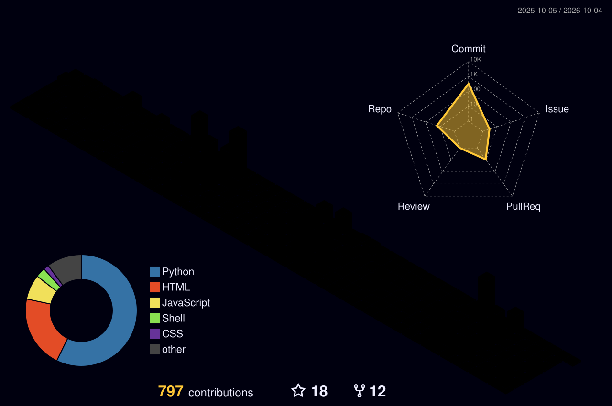

<div align="center">
  
</div>

<div align="center">
  <a href="https://www.ed.ac.uk/"></a>
  <a href="https://atharvatilewale.github.io"></a>
  <a href="https://doi.org/10.64898/2026.09.18.752645"></a>
  <a href="https://pypi.org/project/smilesherlock/"></a>
</div>

<br>

<div align="center">

Most computational biology dies in the gaps between tools — a format that doesn't convert,
a GROMACS flag nobody documented, an analysis step that takes a week to get right once.
**I build the pieces that close those gaps**, and I publish them so the next person doesn't repeat the week.

</div>

---

## The pipeline I've been building

```
   ┌──────────────┐      ┌──────────────┐      ┌──────────────┐      ┌──────────────┐
   │   PREPARE    │ ───▶ │   PREDICT    │ ───▶ │   SIMULATE   │ ───▶ │   ANALYSE    │
   └──────────────┘      └──────────────┘      └──────────────┘      └──────────────┘
                                                                     
    SmileSherlock          Boltz2-Notebook        GRAVITy              ConformAtlas
    Genome Inspector       NiV-G Binders          GROMACS · CUDA       FELBuilder
                                                                     
    SMILES → structure     sequence → fold        ns of dynamics       PCA · free energy
    PubChem · RDKit        Boltz-2 · BoltzGen     automated, resumable  publication plots
```

<sub><i>Four stages, four tools — each one written because the manual version cost me a week.</i></sub>

---

## Shipped & citable

<table>
<tr>
<td width="33%" align="center">
<a href="https://doi.org/10.64898/2026.09.18.752645"><b>bioRxiv preprint</b></a><br>
<sub>Boltz2-Notebook</sub><br><br>
<code>10.64898/2026.09.18.752645</code>
</td>
<td width="33%" align="center">
<a href="https://pypi.org/project/smilesherlock/"><b>PyPI package</b></a><br>
<sub>SmileSherlock</sub><br><br>
<code>pip install smilesherlock</code>
</td>
<td width="33%" align="center">
<a href="https://doi.org/10.5281/zenodo.22132214"><b>Zenodo DOI</b></a><br>
<sub>archived release</sub><br><br>
<code>10.5281/zenodo.22132214</code>
</td>
</tr>
</table>

---

## What each one actually does

**[Boltz2-Notebook](https://github.com/AtharvaTilewale/boltz2-notebook)** · `16★` · Python
> Structure prediction and binding affinity with **Boltz-2**, in Colab. No GPU, no environment, no install — which is the entire point. Has a preprint behind it.

**[ConformAtlas](https://github.com/AtharvaTilewale/ConformAtlas)** · Python · CI
> MD ensemble characterisation: PCA and free-energy landscapes, either through GROMACS or by streaming the trajectory directly. The rigorous successor to FELBuilder.

**[GRAVITy](https://github.com/AtharvaTilewale/GRAVITy)** · Shell
> *GROMACS Rapid Analysis and Visualization Interface Tool.* Preparation, minimisation, equilibration, production and error handling as one pipeline — plus a [browser version](https://github.com/AtharvaTilewale/GRAVITy_Web) with live 3D visualisation.

**[NiV-G Binder Designs](https://github.com/AtharvaTilewale/adaptyv-niv-g-binder-designs)** · Protein design
> De novo binders against Nipah virus glycoprotein G for the Adaptyv competition. BoltzGen targeted design, RFdiffusion + SolMPNN blind design, ProteinMPNN receptor mimicry — filtered on RMSD, pLDDT, pTM, ipTM and ipSAE against an MD-defined epitope. Released as a citable dataset.

**[SmileSherlock](https://github.com/AtharvaTilewale/SmileSherlock)** · Python · on PyPI
> SMILES validation and canonicalisation, PubChem lookup, 2D/3D structure generation offline via RDKit. Six input formats, because chemical data never arrives in the one you want.

**[FELBuilder](https://github.com/AtharvaTilewale/FELBuilder)** · Python · **[Genome Inspector](https://github.com/AtharvaTilewale/Genome-Inspector)** · Python · **[mdplots](https://github.com/AtharvaTilewale/mdplots)** · Python
> Single-command FEL plots · DNA analysis on the [desktop](https://github.com/AtharvaTilewale/Genome-Inspector) and in the [browser](https://github.com/AtharvaTilewale/Genome_Inspector_Web) · trajectory plotting helpers.

---

## Working set

<div align="center">

`GROMACS` `OpenMM` `PyMOL` `ChimeraX` `MDAnalysis` `RDKit` · **simulation & structure**

`Boltz-2` `BoltzGen` `AlphaFold` `RFdiffusion` `ProteinMPNN` `PyTorch` `CUDA` · **design & prediction**

`Python` `Biopython` `NumPy` `pandas` `Matplotlib` `R` · **analysis**

`Linux` `Bash` `Git` `Conda` `Modal` `Colab` · **where it runs**

</div>

---

<div align="center">
  
</div>

<div align="center">
  
  
</div>

<div align="center">
  <picture>
    <source media="(prefers-color-scheme: dark)" srcset="dist/github-snake-dark.svg"/>
    
  </picture>
</div>

---

<div align="center">

### If you're working on protein design, MD, or the tooling around them — talk to me.

<a href="https://www.linkedin.com/in/atharvatilewale"></a>
<a href="mailto:tilewale.atharva@gmail.com"></a>
<a href="https://atharvatilewale.github.io"></a>
<a href="https://www.buymeacoffee.com/atharva16at"></a>

</div>

<div align="center">
  
</div>
