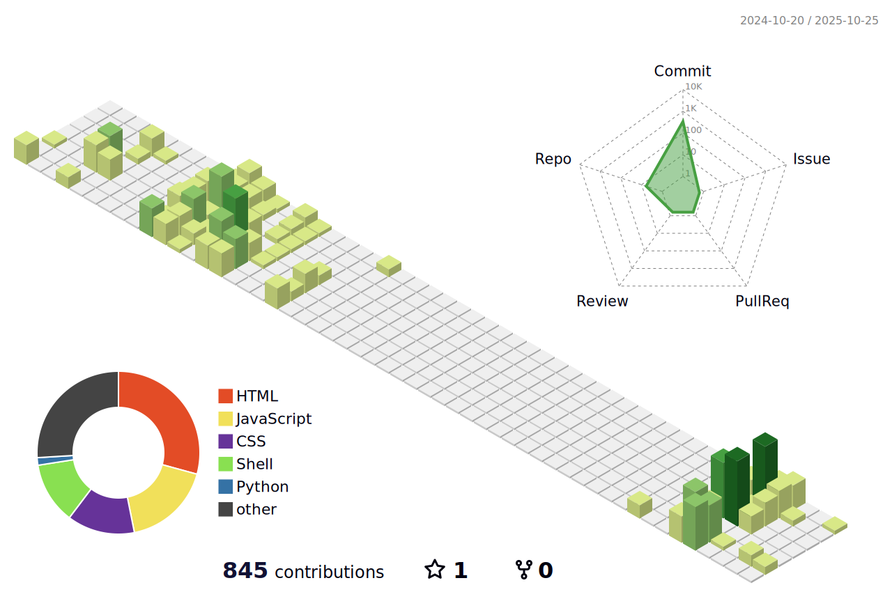

<!-- # 
 Welcome to Atharva's Digital Universe 
 -->

  

<!-- # Hi 👋, I'm Atharva Tilewale
### Biotechnologist | Bioinformatician | Computational Biologist -->

  

---

## About Me

I'm a computational biologist with a passion for turning complex biological data into actionable insights. My work focuses on **drug discovery, protein engineering, and molecular dynamics simulations**. I enjoy building open-source tools that empower researchers and accelerate scientific discovery.

> **My Vision**: To design AI-powered pipelines and platforms that accelerate drug discovery, genome analysis, and systems biology — making breakthroughs in healthcare and biotechnology more accessible.

---

## Skills & Technologies

This is my tech stack—the tools and technologies I use to build, analyze, and innovate.

  <strong>Bioinformatics & Computational Biology</strong> 
  
  
  
  
  
  
  <!-- 
  
  
   -->

  <strong>Data Science & AI</strong> 
  
  
  

  <strong>Developer Tools & Platforms</strong> 
  
  
  
  
  
  
  

---

## Featured Projects

Here are some of the open-source projects I'm passionate about.

  
  

---

## GitHub Stats & Activity Dashboard

  
  
    
  
    
  
    

<!---->

  

---

## Let's Connect

I'm always open to discussing new projects, research ideas, or collaboration opportunities. Feel free to reach out!

  
  
  

 

> ⭐️ *"Turning biological complexity into computational clarity."*

---

  

