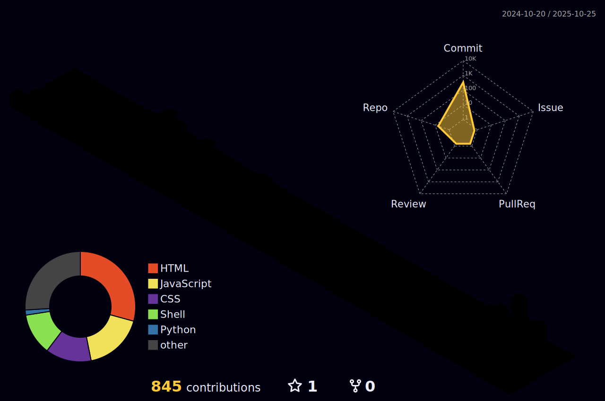

<!DOCTYPE html>
<html lang="en">
<head>
    <meta charset="UTF-8">
    <meta name="viewport" content="width=device-width, initial-scale=1.0">
</head>
<body style="background-color: #0D1117; font-family: 'Segoe UI', Tahoma, Geneva, Verdana, sans-serif; color: #c9d1d9; margin: 0; padding: 0;">

    

    

        
    

    

        

            🌌 About Me
        

        

            I'm a computational biologist with a passion for turning complex biological data into actionable insights. My work focuses on <strong>drug discovery, protein engineering, and molecular dynamics simulations</strong>. I enjoy building open-source tools that empower researchers and accelerate scientific discovery.
        

        <blockquote style="border-left: 4px solid #4ea8de; padding-left: 16px; margin: 20px 0; font-style: italic; color: #8b949e;">
            <strong>My Vision:</strong> To design AI-powered pipelines and platforms that accelerate drug discovery, genome analysis, and systems biology — making breakthroughs in healthcare and biotechnology more accessible.
        </blockquote>
    

    

        

            🛠️ Skills & Technologies
        

        

            This is my tech stack—the tools and technologies I use to build, analyze, and innovate.
        

        

            

                <h3 style="color: #4ea8de; border-bottom: 2px solid #30363d; padding-bottom: 5px; display: inline-block;">Bioinformatics & Computational Biology</h3>  
                
                
                
                
                
                
            

            

                <h3 style="color: #4ea8de; border-bottom: 2px solid #30363d; padding-bottom: 5px; display: inline-block;">Data Science & AI</h3>  
                
                
                
            

            

                <h3 style="color: #4ea8de; border-bottom: 2px solid #30363d; padding-bottom: 5px; display: inline-block;">Developer Tools & Platforms</h3>  
                
                
                
                
                
                
                
            

        

    

    

        

            🚀 Featured Projects
        

        

            Here are some of the open-source projects I'm passionate about.
        

        

            
            
        

    

    

        

            📊 GitHub Stats & Activity
        

        

            
            
            
              
            
              
            
              
            
              
            
        

    

    

        

            🤝 Let's Connect
        

        

            I'm always open to discussing new projects, research ideas, or collaboration opportunities. Feel free to reach out!
        

        

            
            
            
        

        

            ⭐ "Turning biological complexity into computational clarity."
        

    

    

</body>
</html>